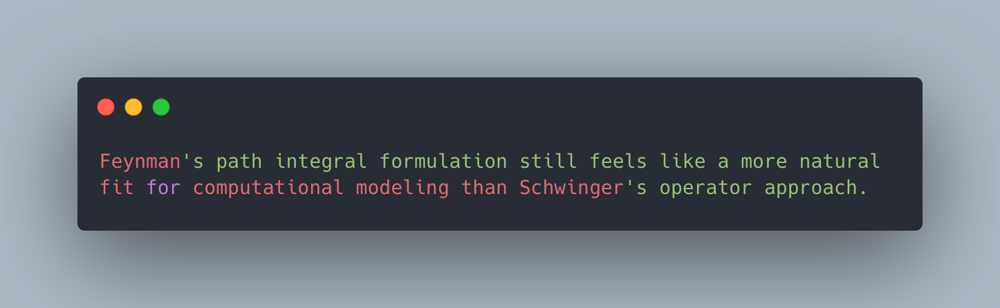

# X Ai Bot 
> Written In Rust



Autonomous Twitter/X bot written in Rust. Picks a trending Hacker News story, asks Groq's LLM to ghostwrite a tweet about it, then posts it via a third-party X API wrapper. Runs on a schedule using [Chronographer](https://github.com/GitBrincie212/ChronoGrapher) task scheduling.

## How it works

1. **Scheduler** ([task.rs](src/task.rs)) — a Chronographer task fires on a cron schedule.
2. **Topic** ([ai.rs](src/ai.rs)) — fetches a random story from HN's top stories as the "catalyst" topic, keeping Groq's output from repeating itself.
3. **Generation** ([ai.rs](src/ai.rs)) — sends topic + system prompt ([constant.rs](src/constant.rs)) to Groq (`llama-3.3-70b-versatile`), gets back tweet text.
4. **Post** ([post.rs](src/post.rs)) — registers an X session and posts the tweet through [twitterapis.com](https://twitterapis.com), a third-party API (no official X API credentials needed).

See [problem.md](problem.md) for design decisions and tradeoffs.

## Setup

Copy `.env.example` to `.env` and fill in:

```
TWITTERAPIS_KEY=
GROQ_API_KEY=
X_AUTH_TOKEN=
X_CT0=
```

- `TWITTERAPIS_KEY` — API key for twitterapis.com
- `GROQ_API_KEY` — Groq API key
- `X_AUTH_TOKEN` / `X_CT0` — session cookies from an X account (use a throwaway/test account, not your main one)

## Run

```
cargo run
```

## Notes

- Third-party X API is used for read/testing convenience, not recommended for write operations on a real account — see [problem.md](problem.md).